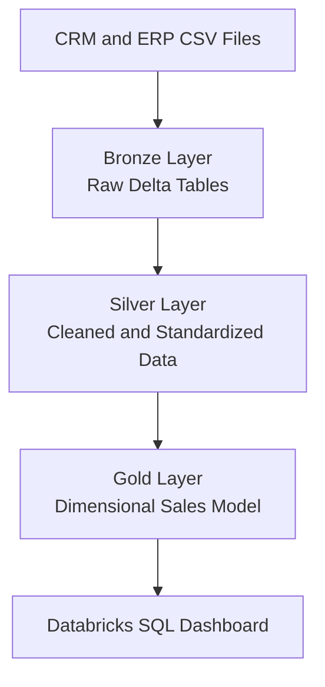
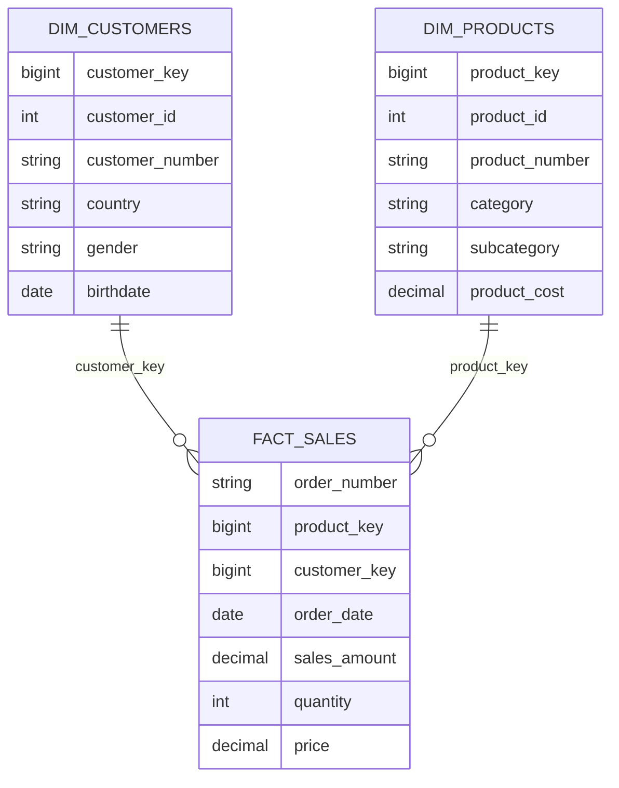

# Databricks Sales Data Warehouse

An end-to-end sales data warehouse built in **Databricks** using **PySpark, Spark SQL, Delta Lake, Unity Catalog, and the Medallion Architecture**.

This project ingests raw CRM and ERP data, cleans and standardizes it through the Bronze and Silver layers, creates a dimensional model in the Gold layer, and presents business insights through an interactive Databricks SQL dashboard.

[View the published Databricks dashboard](https://dbc-e918c021-2bfe.cloud.databricks.com/dashboardsv3/01f199c6467c1072b78d054678291172/published?o=7474650609772269)

## Project Overview

The project demonstrates a complete modern data-engineering and analytics workflow:

- Ingesting multiple CRM and ERP CSV files
- Building Delta tables in Databricks
- Applying data cleaning and standardization with PySpark
- Integrating customer and product data from multiple source systems
- Designing customer and product dimensions
- Building a central sales fact table
- Orchestrating transformations with Databricks notebooks
- Exploring the warehouse using Spark SQL
- Creating an interactive sales dashboard with KPIs, charts, and filters

## Architecture



The implementation follows the Databricks Medallion Architecture:

| Layer | Purpose |
| --- | --- |
| Bronze | Ingest and preserve source data in Delta tables |
| Silver | Clean, validate, standardize, and prepare each dataset |
| Gold | Integrate the datasets into business-ready dimensions and facts |
| Dashboard | Convert the Gold data into interactive business insights |

## Data Sources

The warehouse integrates six source files from two operational systems.

### CRM source

| Source file | Description | Bronze table |
| --- | --- | --- |
| `cust_info.csv` | Customer profile information | `workspace.bronze.crm_cust_info` |
| `prd_info.csv` | Product information | `workspace.bronze.crm_prd_info` |
| `sales_details.csv` | Sales transactions | `workspace.bronze.crm_sales_details` |

### ERP source

| Source file | Description | Bronze table |
| --- | --- | --- |
| `CUST_AZ12.csv` | Additional customer attributes | `workspace.bronze.erp_cust_az12` |
| `LOC_A101.csv` | Customer location information | `workspace.bronze.erp_loc_a101` |
| `PX_CAT_G1V2.csv` | Product category and maintenance information | `workspace.bronze.erp_px_cat_g1v2` |

## Bronze Layer

The Bronze notebook implements configuration-driven ingestion.

### Work completed

- Defined a reusable ingestion configuration for all CRM and ERP files
- Read CSV files from Databricks volumes
- Used headers and schema inference during ingestion
- Loaded each source dataset into a managed Delta table
- Applied overwrite-based batch loading for repeatable execution
- Preserved source-specific table names for lineage and traceability
- Added table previews and SQL checks to verify the ingested data

## Silver Layer

The Silver layer contains individual transformation notebooks for every CRM and ERP dataset. A Silver orchestration notebook executes all transformations from a single entry point.

### CRM customer transformation

The customer pipeline:

- Trims leading and trailing whitespace from string columns
- Standardizes marital-status values as `Single`, `Married`, or `n/a`
- Standardizes gender values as `Female`, `Male`, or `n/a`
- Removes records without a customer ID
- Renames technical source fields to descriptive business names
- Writes the result to `workspace.silver.crm_customers`

Key output fields include:

- `customer_id`
- `customer_number`
- `first_name`
- `last_name`
- `marital_status`
- `gender`
- `created_date`

### CRM product transformation

The product pipeline:

- Trims string columns
- Extracts and standardizes the category ID from the product key
- Separates the product number from the original composite key
- Replaces missing product costs with zero
- Converts abbreviated product-line values into descriptive labels
- Casts product start dates to a proper date type
- Renames source columns using business-friendly names
- Writes the result to `workspace.silver.crm_products`

Product-line codes are standardized as:

| Source value | Standardized value |
| --- | --- |
| M | Mountain |
| R | Road |
| S | Other Sales |
| T | Touring |
| Other or missing | n/a |

### CRM sales transformation

The sales pipeline:

- Trims string columns
- Validates order, shipping, and due-date values
- Converts valid `yyyyMMdd` values into Spark date fields
- Replaces invalid or zero date values with null
- Corrects missing or non-positive prices using sales amount divided by quantity
- Protects the price calculation from division by zero
- Renames technical sales fields to descriptive names
- Writes the result to `workspace.silver.crm_sales`

Key output fields include:

- `order_number`
- `product_number`
- `customer_id`
- `order_date`
- `ship_date`
- `due_date`
- `sales_amount`
- `quantity`
- `price`

### ERP customer transformation

The ERP customer pipeline:

- Trims string columns
- Removes the `NAS` prefix from customer identifiers
- Validates birthdates and replaces future dates with null
- Standardizes gender values
- Renames columns to align with the CRM customer dataset
- Writes the result to `workspace.silver.erp_customers`

### ERP customer-location transformation

The location pipeline:

- Trims string columns
- Removes hyphens from customer identifiers
- Standardizes country codes and country names
- Converts `DE` to `Germany`
- Converts `US` and `USA` to `United States`
- Replaces missing country values with `n/a`
- Writes the result to `workspace.silver.erp_customer_location`

### ERP product-category transformation

The product-category pipeline:

- Trims string columns
- Converts `YES` and `NO` maintenance values into Boolean values
- Renames category fields using consistent business terminology
- Writes the result to `workspace.silver.erp_product_category`

## Gold Layer

The Gold layer integrates the cleaned datasets into a dimensional model optimized for reporting and analytics.



### Customer dimension

The `workspace.gold.dim_customers` table:

- Integrates CRM customer records with ERP demographics and locations
- Uses the common customer number to join multiple source systems
- Generates a surrogate `customer_key` with a window function
- Prioritizes the standardized CRM gender value and supplements it with ERP data
- Includes customer identity, name, country, marital status, gender, birthdate, and creation date

### Product dimension

The `workspace.gold.dim_products` table:

- Integrates cleaned CRM products with ERP product categories
- Generates a surrogate `product_key`
- Connects products to categories through `category_id`
- Includes product identity, product number, name, category, subcategory, maintenance status, product line, cost, and start date

### Sales fact table

The `workspace.gold.fact_sales` table:

- Uses cleaned CRM sales transactions as its foundation
- Connects each transaction to the customer dimension
- Connects each transaction to the product dimension
- Stores order, shipping, and due dates
- Stores sales amount, quantity, and unit price
- Provides the central analytical table for sales reporting

## Notebook Orchestration

Two orchestration notebooks provide simple entry points for executing the data pipeline.

### Silver orchestration

The Silver orchestration notebook runs:

1. CRM customer transformation
2. CRM product transformation
3. CRM sales transformation
4. ERP customer transformation
5. ERP customer-location transformation
6. ERP product-category transformation

### Gold orchestration

The Gold orchestration notebook runs:

1. Customer-dimension creation
2. Product-dimension creation
3. Sales-fact creation

The notebooks use `dbutils.notebook.run()` to execute each transformation in the required order and can be used as Databricks Job tasks.

## Data Exploration

The project includes an exploration notebook that uses Spark SQL to:

- List the Gold tables
- Inspect the schemas of the dimensions and fact table
- Preview warehouse records
- Identify countries represented in sales
- Explore products, categories, and subcategories connected to transactions

## Databricks Dashboard

The project includes a Databricks Lakeview dashboard named **EDA Sales Data**.

[Open the EDA Sales Data dashboard](https://dbc-e918c021-2bfe.cloud.databricks.com/dashboardsv3/01f199c6467c1072b78d054678291172/published?o=7474650609772269)

### Dashboard KPIs

- Total sales
- Total profit
- Total quantity sold

### Dashboard visualizations

- Monthly sales trend
- Sales distribution by product category

### Interactive filters

- Product category
- Date range
- Customer country

The dashboard dataset combines the sales fact table with the customer and product dimensions to support analysis across time, geography, and product categories.

## Repository Structure

```text
Datawarehouse_databricks/
├── README.md
├── Warehouse/
│   ├── Bronze_Layer/
│   │   └── Bronze.ipynb
│   ├── Silver_Layer/
│   │   ├── Silver_orchestration.ipynb
│   │   ├── crm/
│   │   │   ├── Silver_crm_cust_info.ipynb
│   │   │   ├── Silver_crm_prd_info.ipynb
│   │   │   └── Silver_crm_sales_details.ipynb
│   │   └── erp/
│   │       ├── Silver_erp_cust_az12.ipynb
│   │       ├── Silver_erp_loc_a101.ipynb
│   │       └── Silver_erp_px_cat_g1v2.ipynb
│   └── Gold_Layer/
│       ├── Gold_orchestration.ipynb
│       ├── Gold_dim_customers.ipynb
│       ├── Gold_dim_products.ipynb
│       └── Gold_fact_sales.ipynb
└── Dashboard/
    ├── Exploring Data.ipynb
    └── Exploring Sales Data.lvdash.json
```

## Technology Stack

- Databricks
- Apache Spark
- PySpark
- Spark SQL
- Delta Lake
- Unity Catalog
- Databricks Volumes
- Databricks Notebooks
- Databricks Workflows
- Databricks SQL and Lakeview Dashboards
- GitHub

## Running the Project

1. Create the required Bronze, Silver, and Gold schemas in Databricks.
2. Upload the CRM and ERP CSV source files to the configured Databricks volume locations.
3. Run `Warehouse/Bronze_Layer/Bronze.ipynb`.
4. Run `Warehouse/Silver_Layer/Silver_orchestration.ipynb`.
5. Run `Warehouse/Gold_Layer/Gold_orchestration.ipynb`.
6. Use `Dashboard/Exploring Data.ipynb` to inspect the completed warehouse.
7. Import or open the Lakeview dashboard to explore the sales KPIs and visualizations.

## Skills Demonstrated

This project highlights practical experience with:

- Medallion data architecture
- Batch data ingestion
- Configuration-driven pipelines
- PySpark DataFrame transformations
- Data cleaning and validation
- Multi-source CRM and ERP integration
- Delta table creation
- Dimensional modeling
- Surrogate-key generation
- Fact and dimension table design
- SQL-based analytics
- Notebook orchestration
- KPI development
- Interactive dashboard design
- Git-based project organization

## Author

**Jaswanth Ravipati**

- GitHub: [JaswanthRavipati](https://github.com/JaswanthRavipati)
- Dashboard: [EDA Sales Data](https://dbc-e918c021-2bfe.cloud.databricks.com/dashboardsv3/01f199c6467c1072b78d054678291172/published?o=7474650609772269)
